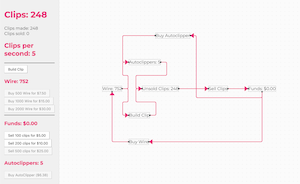

# Universal Paperclips

A clone of [Universal Paperclips](https://www.decisionproblem.com/paperclips/) by Frank Lantz.

I wanted to test how to run a game loop at 60FPS within React, and learn some of the game mechanics for myself. The original is far better.

## Screenshot

## Updates

- Added game loop, clips, and free autoclippers
- Added extremely large number formatting (printing numbers up to 999 novenonagintillion)
- Added time formatting: Yy Dd Hh Mm S.MMMs (eg 123y 45d 01h 23m 45.678s)
- Added funds, selling clips, and buying autoclippers.

# Dev

## Building the code

`yarn run watch` or `npm run watch`: Watches files and updates when source changes

`yarn run build` or `npm run build`: Builds the project and copies the index.html file